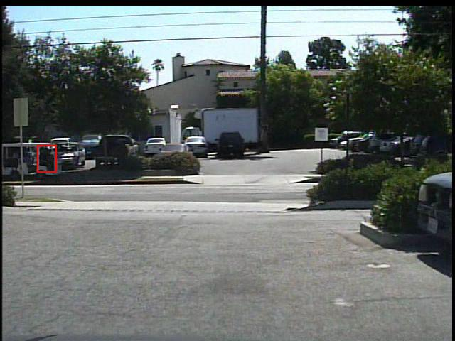
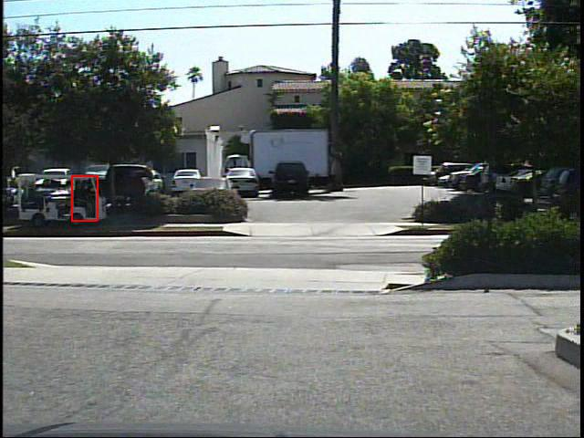
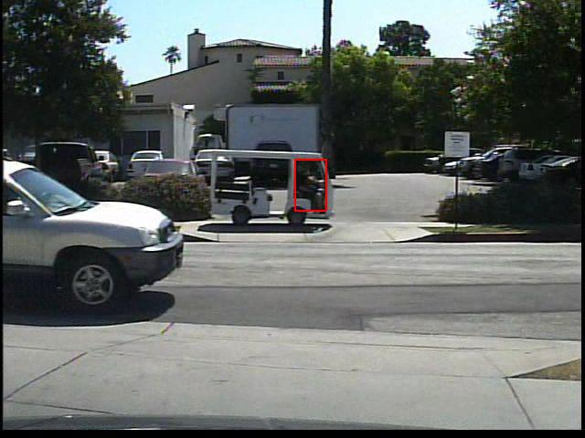
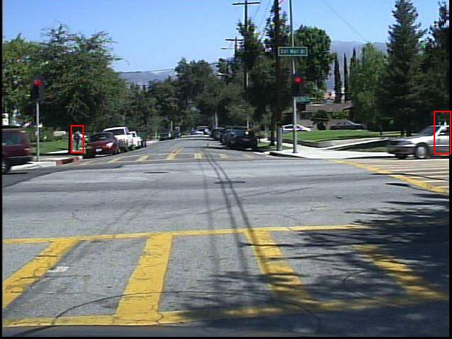
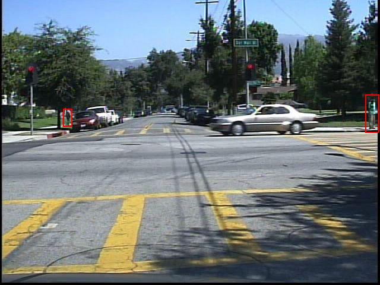

## Datasets

> [download.BaiduYun](https://pan.baidu.com/s/1_gYK6iXQDxJnRwlmiTagFw)

### INRIAPerson

> [homepage](http://pascal.inrialpes.fr/data/human/)

### Caltech

> [homepage](http://www.vision.caltech.edu/Image_Datasets/CaltechPedestrians/)

> [convert tool](https://github.com/hizhangp/caltech-pedestrian-converter)

### DukeMTMC-reID

> [github.repo](https://github.com/layumi/DukeMTMC-reID_evaluation)

> [BaiduBaike](https://baike.baidu.com/item/%E8%A1%8C%E4%BA%BA%E9%87%8D%E8%AF%86%E5%88%AB/20815009?fr=aladdin#5)

以人搜人，与物体检测不太符合

### RAP